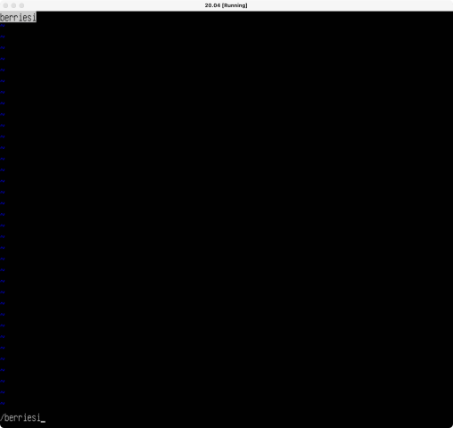
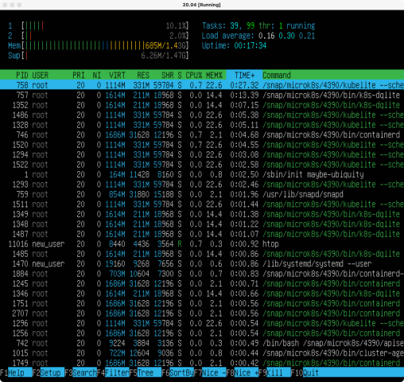
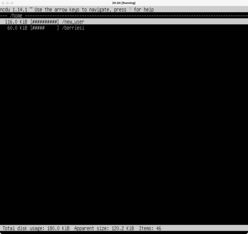

# Report

## Part 1
- 
  > cat /etc/issue print current version of your linux based os, in this example - `Ubuntu 20.04.5 LTS`

## Part 2
- 
  > you can create a user with this command - `adduser [USER_NAME}`

 

- 
  > you can view all users with this command - `cat /etc/passwd`

## Part 3
- 
  > you can change machine name by editing `/etc/hostname` and `/etc/hosts`

 

- 
  > you can set the timezone with this command `sudo timedatectl set-timezone [YOUR_TIMEZONE]`

 

- 
  > you can view names of the network interfaces with this command - `ip link show` 

  The loopback device (lo) is a special, virtual network interface that your computer uses to communicate with itself. It is used mainly for diagnostics and troubleshooting, and to connect to servers running on the local machine

 

- 
  > you can get the ip fro, the dchp with this command - `sudo dhclinet -v` 

  DHCP stands for Dynamic Host Configuration Protocol 

 

- 
  > you can check your external and internal ip with this commands - `hostname -I` , `curl checkip.amazonaws.com`

 

- 
  > you can set static ip, gw and dns by editing `/etc/netplan/01-network-manager-all.yaml`

 

- 
  > you can ping with this command - `ping [REMOTE_HOST]`

## Part 4
- 
  > you can update your ubuntu with this commands - `sudo apt update && sudo apt upgrade`

## Part 5
- 

  sudo allows a system administrator to delegate authority to give certain users—or groups of users—the ability to run commands as root or another user while providing an audit trail of the commands and their arguments. 

## Part 6
- 
  > you can check current time with this command - `date` and current timezone with this command - `timedatectl show`

## Part 7
- 

  you can exit with changes from emacs with this command - `C-x C-s`

 

- 

  you can exit with changes from nano with this command - `^O ^X`

 

- 

  you can exit with changes from vim with this command - `:wq`

 

- 

  you can exit with without changes from emacs with this command - `C-x C-c`

 

- 

  you can exit with without changes from nano with this command - `^X`

 

- 

  you can exit with without changes from vim with this command - `:q!`

 

- 

 

- 

 

- 

 

- 

 

- 

 

- 

## Part 8
- 
  > `ps` displays information about a selection of the active processes, `-e` flag displays every process on the system 

 

- 
  
  you can install SSHd with `sudo apt install openssh-server` \
  add service to an auto-start with `sudo systemctl enable ssh` \
  reset SSHd to port 2022 by editing `/etc/ssh/sshd_config` \
  reboot system with `reboot`

## Part 9

- .png)

  uptime is 10 min\
  number of authorised users is 1\
  total system load is 0.64%\
  total number of processes is 134\
  cpu load is 5.9%\
  memory load is 695.5\
  pid of the process with the highest memory usage is 758\
  pid of the process taking the most CPU time is 758

 

- 

 

- 

 

- 

 

- 

 

- 

 

- 

 

- 

## Part 10

- 

  name of the hard disk is /dev/sda, its capacity is 10G, number of sectors is 20971520 and swap size is 1.8G

## Part 11

- 

  partition size is 8408452B\
  space used is 6382128B\
  space free is 1577608B\
  percentage used is 81%

 

- 

  partition size is 8.1G\
  space used is 6.1G\
  space free is 1.6G\
  percentage used is 81% 

## Part 12

- 

 

- 

## Part 13

- 

 

- 

 

- 

## Part 14

- 

  last successful login time is 18:05:47\
  user name is new_user\
  login method is LOGIN(uid=0)\

 

- 

## Part 15

- 

 

- 

 

- 
  > current jobs for CRON

 

- 
  > no jobs for CRON after removing all tasks